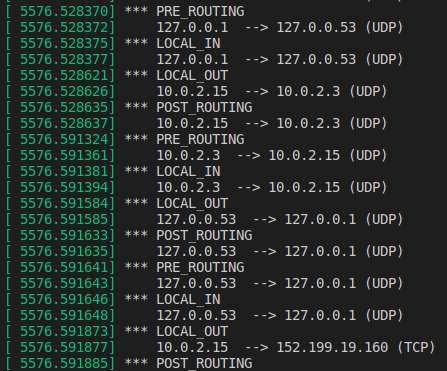
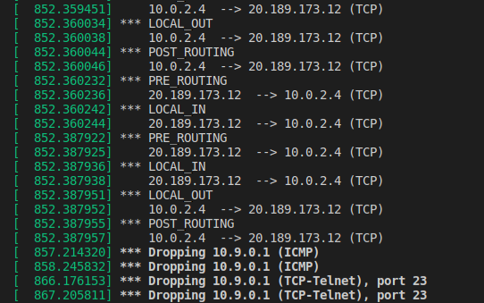
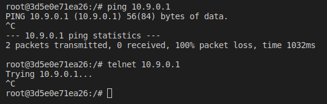
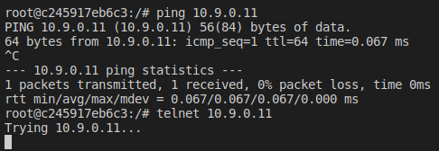

# Ch3 - Firewall Exploration Lab

## 3.2 Task 1.B: Implement a Simple Firewall Using Netfilter

2. Using your experiment results to help explain at what condition will each of the hook function be invoked:

When a network packet is received on a network device, it first passes through the Prerouting hook. This is where the routing decision takes place. The kernel decides whether the packet is destined for a local process (e.g., a listening socket on a server in this system) or whether to forward it (system operates as a router). In the first case, the packet passes the Input hook and is then handed over to the local process.  If the packet is destined to be forwarded, it traverses the Forward hook and then a final Postrouting hook before being sent out on a network device. For packets that are generated locally (e.g., by a client or server process that likes sending things out), they must first pass the Output hook and then the  Postrouting hook before being sent out on a network device.

By the following output logs of the LKM, we can check the ordered flow of hooks just described.



3. LKM blocks ping and Telnet packets:





## 5.1 Task 2.A: Protecting the Router

Please report your observation and explain the purpose for each rule:

```console
iptables -A INPUT -p icmp --icmp-type echo-request -j ACCEPT
```

The previous command append the rule to the end of the INPUT chain, filter table. The protocol of the rule is the ICMP, the type of ICMP packets to check is the echo-request one. The target of the rule, i.e., what to do if the packet matches it, is to leave them to pass.

```console
iptables -A OUTPUT -p icmp --icmp-type echo-reply -j ACCEPT
```

The previous command append the rule to the end of the OUTPUT chain, filter table. The protocol of the rule is the ICMP, the type of ICMP packets to check is the echo-reply one. The target of the rule, i.e., what to do if the packet matches it, is to leave them to pass.

```console
iptables -P OUTPUT DROP
```

The previous command set the policy for the built-in (non-user-defined) OUTPUT chain to the given target, filter table. The policy target is to DROP.

```console
iptables -P INPUT DROP
```

The previous command set the policy for the built-in (non-user-defined) INPUT chain to the given target, filter table. The policy target is to DROP.

1. Can you ping the router? Yes, I can. The firsts two commands launched on the router create two rules for the INPUT and OUTPUT chains that allow ICMP echo-requests and ICMP echo-replies packets respectively to pass. Since iptables entries are applied in order, these two specified rules will be applied before the default behavior.

2. Can you telnet into the router? No, I can't. Since the last two commands launched on the router set as dafult behaviour for the INPUT and OUTPUT chains to drop every kind of packet that doesn't match any of the previously specified rules in the tables.



## 5.2 Task 2.B: Protecting the Internal Network

1. Outside hosts cannot ping internal hosts.

2. Outside hosts can ping the router. No actions required since pinging the router do not involve the FORWARD, but I implement the following (similar to the previous task):
```console
# accept all the traffic exchanged between the internal network and the router
iptables -A INPUT -s 192.168.60.0/24 -j ACCEPT
iptables -A OUTPUT -d 192.168.60.0/24 -j ACCEPT

# accept the ping packets directed to the router
iptables -A INPUT -p icmp --icmp-type echo-request -j ACCEPT
iptables -A OUTPUT -p icmp --icmp-type echo-reply -j ACCEPT

# block all the other packets directed toward the router and going out from the router
iptables -P OUTPUT DROP
iptables -P INPUT DROP
```

3. Internal hosts can ping outside hosts.
```console
iptables -A FORWARD -i eth0 -o eth1 -p icmp --icmp-type echo-reply -j ACCEPT

iptables -A FORWARD -i eth1 -o eth0 -p icmp --icmp-type echo-request -j ACCEPT
```

4. All other packets between the internal and external networks should be blocked.
```console
iptables -A FORWARD -p icmp -j DROP
```

## 5.3 Task 2.C: Protecting Internal Server

1. All the internal hosts run a telnet server (listening to port 23). Outside hosts can only access the telnet server on 192.168.60.5, not the other internal hosts.
```console
iptables -A FORWARD -i eth0 -o eth1 -p tcp --dport 23 -d 192.168.60.5 -j ACCEPT
```

2. Outside hosts cannot access other internal servers.
```console
iptables -A FORWARD -i eth0 -p tcp --dport 23 -j DROP
```

3. Internal hosts can access all the internal servers. Works by default.

4. Internal hosts cannot access external servers.
```console
iptables -A FORWARD -o eth0 -p tcp --dport 23 -j DROP
```

5. In this task, the connection tracking mechanism is not allowed. It will be used in a later task.

## 6.1 Task 3.A: Experiment with the Connection Tracking (Optional)

1. ICMP experiment: Run the following command and check the connection tracking information on the router. Describe your observation. How long is the ICMP connection state be kept? After 29 seconds, the ICMP state is removed from the tracking mechanism (if no more pings are sent from 10.9.0.5). The countdown to the deletion of the connection is written as the 3rd value of the output returned. The 2nd value is the id of the protocol used, while the other values describe the header fields of the IP/ICMP packets exchanged. The "mark" metadata is a user settable value that specifies like a class for each connection.
```console
icmp     1 29 src=10.9.0.5 dst=192.168.60.5 type=8 code=0 id=50 src=192.168.60.5 dst=10.9.0.5 type=0 code=0 id=50 mark=0 use=1
conntrack v1.4.5 (conntrack-tools): 1 flow entries have been shown.
```

2. UDP experiment: Run the following command and check the connection tracking information on the router. Describe your observation. How long is the UDP connection state be kept? The connection starts to be tracked when 10.9.0.5 sends at least one UDP packets. If 192.168.60.5 doesn't send back any UDP packet, then after 30 seconds the UDP state is removed from the tracking mechanism (if no more UDP packets are exchanged). Also, in this case the status UNREPLIED compare in the tracking system for this state. Otherwise, if 192.168.60.5 sends back some UDP packets to it, then the connection status is marked as ASSURED and after 120 seconds the UDP state is removed from the tracking mechanism (if no more UDP packets are exchanged). When a connection has seen traffic in both directions, the conntrack entry will erase the [UNREPLIED] flag, and then reset it. The entry that tells us that the connection has not seen any traffic in both directions, will be replaced by the [ASSURED] flag, to be found close to the end of the entry. The [ASSURED] flag tells us that this connection is assured and that it will not be erased if we reach the maximum possible tracked connections. Thus, connections marked as [ASSURED] will not be erased, contrary to the non-assured connections (those not marked as [ASSURED]). 
```console
udp      17 27 src=10.9.0.5 dst=192.168.60.5 sport=35944 dport=9090 [UNREPLIED] src=192.168.60.5 dst=10.9.0.5 sport=9090 dport=35944 mark=0 use=1
conntrack v1.4.5 (conntrack-tools): 1 flow entries have been shown.
```

```console
udp      17 115 src=10.9.0.5 dst=192.168.60.5 sport=54197 dport=9090 src=192.168.60.5 dst=10.9.0.5 sport=9090 dport=54197 [ASSURED] mark=0 use=1
conntrack v1.4.5 (conntrack-tools): 1 flow entries have been shown.
```

3. TCP experiment: Run the following command and check the connection tracking information on the router. Describe your observation. How long is the TCP connection state be kept? After 432000 seconds that the TCP connection is established the state is removed from the tracking mechanism (if no more TCP packets are exchanged). Note that, differently from what happens before, the connection is tracked immediately after we start it from the two machines, without requiring the exchange of other TCP packets.
```console
tcp      6 431997 ESTABLISHED src=10.9.0.5 dst=192.168.60.5 sport=37564 dport=9090 src=192.168.60.5 dst=10.9.0.5 sport=9090 dport=37564 [ASSURED] mark=0 use=1
conntrack v1.4.5 (conntrack-tools): 1 flow entries have been shown.
```

## 6.2 Task 3.B: Setting Up a Stateful Firewall (Optional)

Please rewrite the firewall rules in Task 2.C, but this time, we will add a rule allowing internal hosts to visit any external server (this was not allowed in Task 2.C).

1. All the internal hosts run a telnet server (listening to port 23). Outside hosts can only access the telnet server on 192.168.60.5, not the other internal hosts.
```console
iptables -A FORWARD -p tcp -m conntrack --ctstate ESTABLISHED,RELATED -j ACCEPT

iptables -A FORWARD -p tcp -i eth0 -d 192.168.60.5 --dport 23 --syn -m conntrack --ctstate NEW -j ACCEPT
```

2. Outside hosts cannot access other internal servers.
```console
iptables -A FORWARD -p tcp -i eth0 --dport 23 -j DROP
```

3. Internal hosts can access all the internal servers.

4. Internal hosts can access external servers.

After you write the rules using the connection tracking mechanism, think about how to do it without using the connection tracking mechanism (you do not need to actually implement them). Based on these two sets of rules, compare these two different approaches, and explain the advantage and disadvantage of each approach. When you are done with this task, remember to clear all the rules.

Without using connection tracking mechanism, the firewall rules for this task are less than the firewall rules using connection tracking mechanism (indeed, it is sufficient to not use the rule 4 in task 2.C) because it is not necessary to take into consideration the state of the protocol for this task. However, if we want to implement more sophisticated tasks, it can lead to inaccurate, unsafe, or complicated firewall rules. Indeed, the only way to allow to pass packets of an already established connection in a stateless firewall is to allow specific kinds of packets inside the connections just for some hosts in the network and/or for specific ports, with a specific type. But in this way the administrator have to insert a lot of rules, otherwise he should allows every kind of packet, but this is not totally secure.

The connection tracking mechanism is easiest to use for complex rules and allow to take into consideration the context of the messages.


## 7 Task 4: Limiting Network Traffic (Optional)

Please run the following commands on router, and then ping 192.168.60.5 from 10.9.0.5. Describe your observation. Please conduct the experiment with and without the second rule, and then explain whether the second rule is needed or not, and why.

iptables -A FORWARD -s 10.9.0.5 -m limit --limit 10/minute --limit-burst 5 -j ACCEPT

iptables -A FORWARD -s 10.9.0.5 -j DROP

- Using just the first rule, is like not really using it, since the effect is the same when the router has no filter rules. Indeed, the default behaviour is to let every packet to pass the router.

- Using both the commands, the first time this rule is reached by the ICMP packet, the packet will be accepted; in fact, since the default burst is 5, the first five packets will be accepted. After this, it will be 6 seconds (60/10 seconds) before a packet will be accepted from this rule. The other packets that reach the router before this time will be dropped thanks to the second command. Also, every 6 seconds which passes without matching a packet, one of the burst will be regained; if no packets hit the rule for 30 seconds (6*5 seconds), the burst will be fully recharged; back where we started.

## 8 Task 5: Load Balancing (Optional)

1. Using the nth mode (round-robin). Please provide some explanation for the rules.

```console
iptables -t nat -A PREROUTING -p udp --dport 8080 -m statistic --mode nth --every 3 --packet 0 -j DNAT --to-destination 192.168.60.5:8080 && iptables -t nat -A PREROUTING -p udp --dport 8080 -m statistic --mode nth --every 3 --packet 0 -j DNAT --to-destination 192.168.60.6:8080 && iptables -t nat -A PREROUTING -p udp --dport 8080 -m statistic --mode nth --every 3 --packet 0 -j DNAT --to-destination 192.168.60.7:8080
```

* With the 1st rule, at the beginning the counter for this rule is 0 and if you send a 1st UDP packet to the router’s 8080 port, it gets to 192.168.60.5 because -- packet is set to 0 and this is the first rule in the nat table, so the first to be executed. Then, the counter for this rule go to 1.

* With the 2nd rule in place, if you send a 2nd UDP packet to the router’s 8080 port, you will see that it gets to 192.168.60.6, and the counter for this rule goes to 1, while the first counter goes to 2.

* With the 3rd rule in place, if you send a UDP packet to the router’s 8080 port, you will see that the 3rd of the three packets gets to 192.168.60.7.

2. Using the random mode. Please provide some explanation for the rules.

```console
iptables -t nat -A PREROUTING -p udp --dport 8080 -m statistic --mode random --probability 0.33 -j DNAT --to-destination 192.168.60.5:8080

iptables -t nat -A PREROUTING -p udp --dport 8080 -m statistic --mode random --probability 0.50 -j DNAT --to-destination 192.168.60.6:8080

iptables -t nat -A PREROUTING -p udp --dport 8080 -m statistic --mode random --probability 1.0 -j DNAT --to-destination 192.168.60.7:8080
```

We have to take into consideration that the rules will follow the order of insertion. So:

* With the 1st rule in place, if you send a UDP packet to the router’s 8080 port, select a matching packet with probability 0.33 and forward it to 192.168.60.5.

* With the 2nd rule in place, if you send a UDP packet to the router’s 8080 port, select a matching packet with probability 0.50 and forward it to 192.168.60.6.

* With the 3rd rule in place, if you send a UDP packet to the router’s 8080 port, select a matching packet with probability 1.0 and forward it to 192.168.60.7.